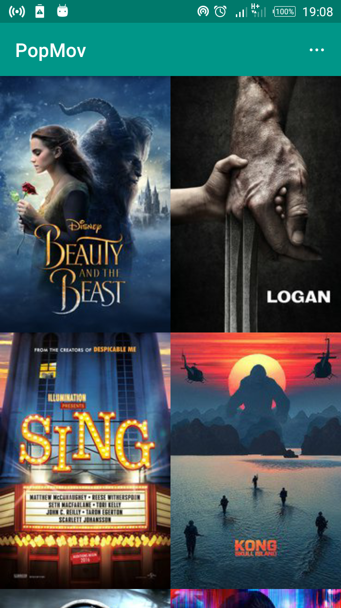
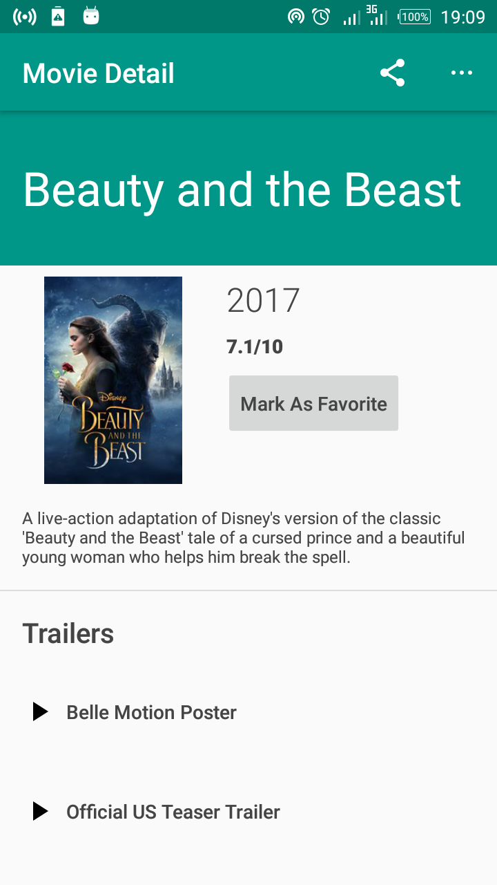
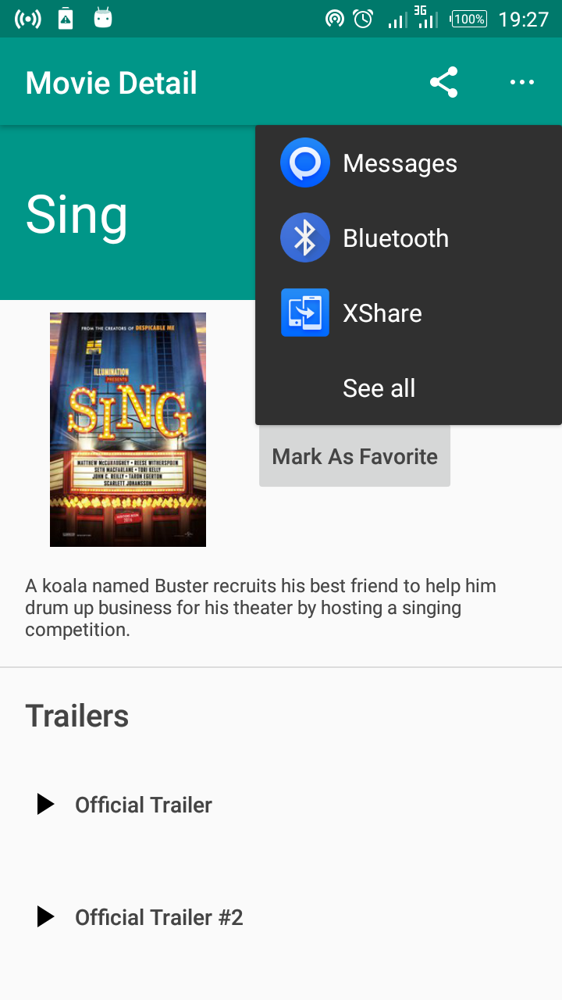
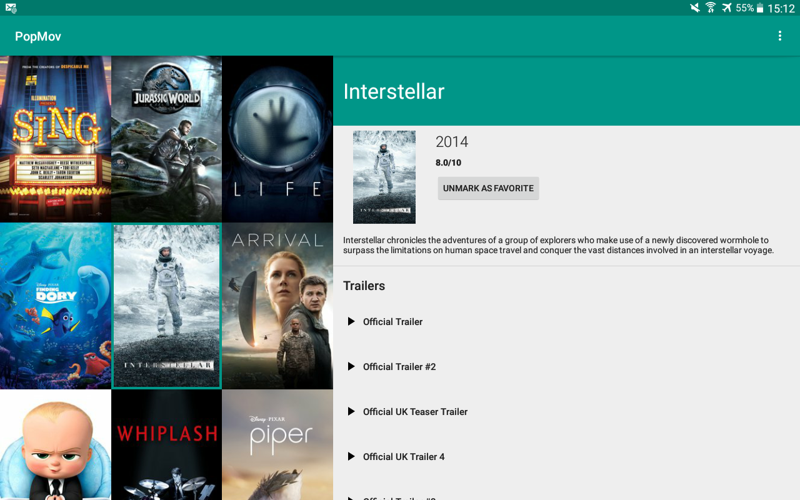
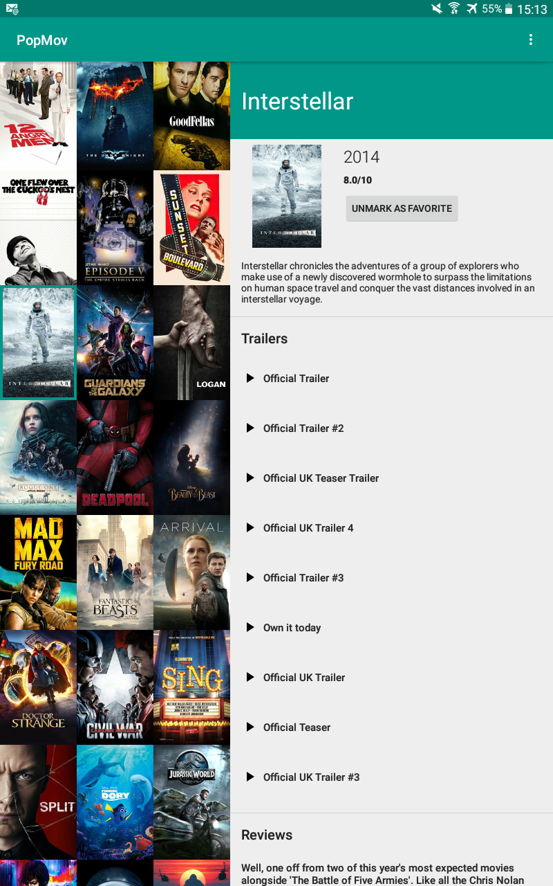
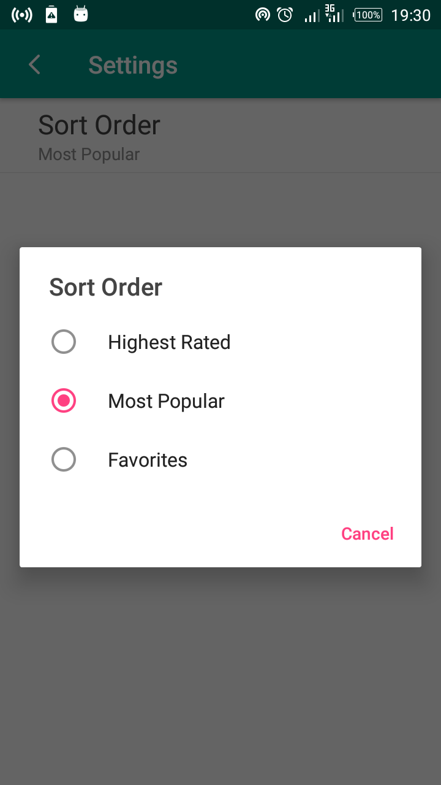

# Popular Movies: Stage Two

## Introduction :point_up:

This is a repository for Stage Two of the Popular Movies assignment found in [Udacity](https://www.udacity.com/)'s [Android Nanodegree](https://www.udacity.com/course/android-developer-nanodegree-by-google--nd801) course. 

The Android app made here fetches movie data from [The Movie Database website](https://www.themoviedb.org/) and displays it. 

It adds to the functionality of [Popular Movies: Stage One](https://github.com/joshua-kairu/popmov-stage-1) by, among other things:

* Letting the user select **favorite movies**.
* Storing all movie data in a **local database**.
* Looking **decent on a tablet**.

## How To Use :wrench:

:zero: Build and run. :smile:

:one: On phones you'll see a screen showing posters of the latest movies. Something like this:



Select a movie poster to see the movie's details. When you do so, you'll see a screen that looks similar to this:

 

In the details section, you can 

* choose to make that movie a favorite by tapping the `Mark As Favorite` button.
* see a list of movie trailers and teasers if they available. Watch a trailer by tapping on it.
* go through a list of reviews by folks over at www.themoviedb.org. The reviews are rated by www.themoviedb.org.
* share the movie's first trailer, if available. Just tap the share icon. You'll see something like this: 



The app has similar features on tablet but looks slightly different. Movie posters and details are shown together to make use of the larger screen size.

Here is how it appears on tablets held horizontally:



PopMov has this appearance on tablets held vertically:



:two: In settings, choose between seeing the highest rated, the most popular, or your favorite movie posters. 

By default, movies are sorted based on how popular they are. (Very subjective, right? :grin:) 

You can find settings in the posters screen's app bar menu on phones, or simply on the app bar menu in tablets.

Settings appears this way on phones:



## How It Works

Below are the steps:

1. Fetch movie JSON from [The Movie Database](https://www.themoviedb.org/)(or TMDB) using a [Sync Adapter](https://developer.android.com/training/sync-adapters/index.html) based on the user's preference as stored in settings (although we won't do any syncing if the user wants to see favorites. More on that in a minute)

1. Store fetched movie data in a SQLite database. All movie data is stored in a table called `Movies`. If the user selects a favorite, the movie's unique id is stored in a table called `Favorites`. More info in the [database source folder](https://github.com/joshua-kairu/popmov-stage-2/tree/master/app/src/main/java/com/joslittho/popmov/data/database).

1. Display movie data using posters from TMDB.

1. For the transition between the various posters to a specific movie detail, pass the movie data as a [Uri](https://developer.android.com/reference/android/net/Uri.html).

1. Share trailer information using a [ShareActionProvider](https://developer.android.com/reference/android/support/v7/widget/ShareActionProvider.html) and [Intents](https://developer.android.com/reference/android/content/Intent.html).

## Abilities :muscle:

* Fetches movie JSON.
* Sorts movies based on user choice.
* Lets user choose favorites.
* Works well on tablets.
* Shows trailers and reviews.

## Limitations :worried:

* Posters do not scroll to where the user was when the user comes back from details. 

## Possible Future Work :fast_forward:

- [ ] Posters should know where the user was!

- [ ] Use transition animations


## Other things :books:

* For this app to run, one needs to have an API key from TMDB. To get one:
	1. Register with TMBD [here](https://www.themoviedb.org/account/signup) and get the API key. API keys for non-commerical use are free as of when I got mine.
	2. For Linux users, please do the following:
		1. Open ~/.gradle/gradle.properties. (Create a new file if there is no such file there.)
		2. In the file add a line containing the name of the API key you want to store followed by an `=` and then the key itself. The name will be the way you will refer to the API key in your gradle code. An example line is:

			`MyAwesomeAPIKey=TH1sIsanAWESOMEAP1K3y`
		
		3. Go to your Android Studio code.
		4. Go the module's `build.gradle` file (for example `app/build.gradle`).
		5. type the following inside the `android{...}` section.
			```
			buildTypes.each {
        			it.buildConfigField 'String', 'REFERENCE_TO_API_KEY_IN_CODE', NameOfAPIKey
			}
			```
		    for example:	
			```
			buildTypes.each {
        			it.buildConfigField 'String', 'AWESOME_API_KEY_IN_CODE', MyAwesomeAPIKey
			}
			```
		6. In Android code, reference the key using:
			`BuildConfig.REFERENCE_TO_API_KEY_IN_CODE`
		    for example:
			`BuildConfig.AWESOME_API_KEY_IN_CODE`

* A lot of gratitude to TMBD for the Movie API.


**This product uses the TMDb API but is not endorsed or certified by TMDb.**

* The following libraries were used to make this app, and we'd like to say thanks to all of their makers and users. :+1::
	- [RxPermissions](https://github.com/tbruyelle/RxPermissions), for acquiring permissions in a [reactive](https://en.wikipedia.org/wiki/Reactive_programming) way.
	- [Retrofit](https://github.com/square/retrofit), [RxJava](https://github.com/ReactiveX/RxJava), [Gson](https://github.com/google/gson), [RxAndroid](https://github.com/ReactiveX/RxAndroid), for fetching movie trailers and reviews painlessly.
	- [ConstraintLayout](https://developer.android.com/training/constraint-layout/index.html) for laying out views simply.
	- [Multidex](https://developer.android.com/studio/build/multidex.html), for 64K method support, brought about by :point_down:
	- [Stetho](http://facebook.github.io/stetho/), for debugging the database. Really helped sort out issues with upgrade.
	- [Schematic](https://github.com/SimonVT/schematic), for autogenerating [ContentProviders](https://developer.android.com/guide/topics/providers/content-providers.html).
	- [The Android Support Library](https://developer.android.com/topic/libraries/support-library/index.html), because it is the Android support library.

## License :lock_with_ink_pen:

This repository is licensed under the [GNU General Public License Version 3](http://www.gnu.org/licenses/gpl-3.0.en.html).